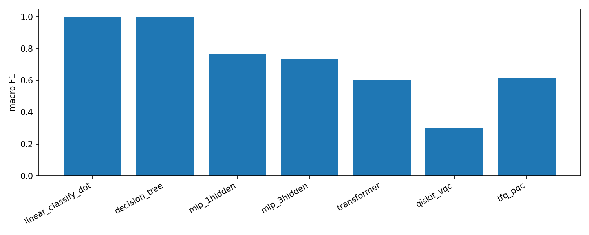

# Сравнительный анализ подходов к классификации географических точек

## Краткое описание

Проект курсовой работы: **сравнение** нескольких способов отнесения точек на сфере к четырём классам: открытое море, прибрежное море, суша у берега и близко к линии берега. Используется **единый** датасет, полученный из **Natural Earth** 50m (суша и линия берега) и вспомогательных вычислений расстояний, разбивается на стратифицированные **train / validation / test** с фиксированным `RANDOM_STATE`.

Для **одного и того же** теста (`X_test`, `y_test` из `data/processed_splits.npz`) сравниваются:

- детерминированный **эталон правил** (`classify_dot`);
- **дерево решений**;
- **полносвязные** нейросети (1 и 3 скрытых слоя);
- лёгкий **табличный трансформер**;
- **квантовые** варианты: **VQC (Qiskit / qiskit-machine-learning)** и **PQC + Keras (TensorFlow Quantum)**.

Метрики пишутся в `data/metrics_all_models.json` из ноутбуков, сводный барчарт — в `plot/metrics_comparison.png` (ноутбук 10). Матрицы ошибок и кривые обучения сохраняются в каталоге `plot/`.

**Классы (метки 0…3):** `OPEN_SEA`, `COASTAL_SEA`, `NEAR_COAST`, `COASTLINE` — заданы в `src/helpers.py` как `CLASS_NAMES`.

---

## Требования

| Компонент | Минимум / рекомендация |
|-----------|------------------------|
| **Python** | **3.10** (задано `requires-python` в `pyproject.toml`) |
| **Менеджер пакетов** | [uv](https://docs.astral.sh/uv/) (рекомендован) или `pip` с теми же версиями из `pyproject.toml` |
| **Jupyter** | `jupyter` / `ipykernel` входят в зависимости проекта |
| **Сеть** | при первом запуске 01 (скачивание **Natural Earth**; кэш: `data/natural_earth_cache/`) |
| **GPU** | **не** обязателен. TensorFlow и симуляция квантов на CPU. В `pyproject.toml` указан `qiskit-aer-gpu` — на машине **без** GPU можно взять обычный `qiskit-aer` и пересобрать lock при необходимости |
| **Память / диск** | сотни МБ на окружение и сгенерированные данные (parquet, npz); квантовые ноутбуки 08–09 могут требовать **больше времени**, чем классические 03–07 |

---

## Установка

Из корня каталога проекта (там, где `pyproject.toml`):

```bash
git clone https://github.com/threenebula23/Comparative-analysis-of-different-approaches.git
cd "comparative analysis of different approaches"
uv sync --python 3.10
```

Запуск **Jupyter** из **этого же** корня (чтобы ноутбуки подхватывали `src/`):

```bash
uv run --python 3.10 jupyter lab
```

---

## Какие архитектуры и методы рассматриваются

| ID | Модель | Ноутбук | Суть |
|----|--------|---------|------|
| **Эталон** | Правила `classify_dot` (пороги по `distance_to_coast_km`, вода/суша) | [03](notebooks/03_linear_baseline.ipynb) | Не обучается, совпадает с логикой, близкой к `dot_classify.ipynb` |
| **Дерево** | `DecisionTreeClassifier` с ограничением глубины, визуализация | [04](notebooks/04_decision_tree.ipynb) | Интерпретируемые ветвления, структура в `plot/decision_tree_structure.png` |
| **MLP-1** | `Dense(64, relu)` + softmax, `EarlyStopping` | [05](notebooks/05_mlp_1layer.ipynb) | Нелинейный бейзлайн, одна «широкая» скрытая прослойка |
| **MLP-3** | Три `Dense` + `Dropout` + softmax | [06](notebooks/06_mlp_3layer.ipynb) | Повышенная ёмкость, риск переобучения контролируется dropout и val |
| **Light Transformer** | Признаки как длина-последовательность, `Reshape` → `Dense(d_model)` → `MultiHeadAttention` → `GlobalAveragePooling1D` → MLP-голова | [07](notebooks/07_transformer_light.ipynb) | «Табличный» вариант внимания без position encoding как в NLP |
| **VQC (Qiskit)** | PCA(4) → 4 кубита, `ZZFeatureMap` + `RealAmplitudes`, VQC, `COBYLA` (через `SciPyOptimizer` из `qiskit_machine_learning`) | [08](notebooks/08_quantum_qiskit.ipynb) | Высокий вычислительный cost; `output_shape` = число классов обязателен |
| **PQC + Keras (TFQ)** | Тот же PCA(4) в углы RX, параметризованная схема Cirq, ожидания **Z** → 2 `Dense` + softmax | [09](notebooks/09_quantum_tfq.ipynb) | Симуляция PQC + классификация в TensorFlow; подвыборка и эпохи в коде снижает время |
| **Сравнение** | Чтение `metrics_all_models.json`, **macro F1** на столбчатой диаграмме | [10](notebooks/10_compare_models.ipynb) | Единая шкала сравнения подходов |

**Данные и фиксация:** [01](notebooks/01_build_global_dataset.ipynb) — `data/global_coastal_points.parquet`; [02](notebooks/02_preprocess_and_split.ipynb) — `data/processed_splits.npz`, `scaler.pkl`, `label_encoder.pkl`. Все оценки на `y_test` совместимы при использовании **одинакового** 02-го split.

---

## Файловая структура (логическая)

```text
comparative analysis of different approaches/
├── pyproject.toml                      # зависимости и lock (uv)
├── README.md                           # этот файл
├── src/
│   ├── helpers.py                      # пути, CLASS_NAMES, RANDOM_STATE, load_xy_from_processed, метрики, JSON-стор
│   └── data_builder.py                 # построение глобального датасета (Natural Earth)
├── data/
│   ├── global_coastal_points.parquet   # после 01
│   ├── processed_splits.npz            # после 02
│   ├── scaler.pkl, label_encoder.pkl   # после 02
│   └── metrics_all_models.json         # накапливается при прогоне 03–09
├── plot/                               # графики
└── notebooks/                          # 01 … 10
```

---

## Порядок работ

1. **01** — сгенерировать/обновить `global_coastal_points.parquet` (параметр `N_PER_CLASS` в ячейке).
2. **02** — `processed_splits.npz` + `scaler.pkl` + `label_encoder.pkl`.
3. **03–09** — по необходимости, в любом порядке **после** 02; каждая тетрадь дополняет `data/metrics_all_models.json` и рисунки в `plot/`.
4. **10** — сводная диаграмма `plot/metrics_comparison.png` по `data/metrics_all_models.json`.

---

## Результаты (по `data/metrics_all_models.json`)

> Значения **ниже** взяты из **текущего** файла метрик в репозитории. После новых прогонов цифры и графики изменятся — **пересоздайте** 10‑й ноутбук и снова откройте картинки.  
> **Accuracy** = доля верных на тесте, **F1 (macro)** = невзвешенное среднее F1 по 4 классам (тот же смысл, что в ноутбуке 10 в столбчатом графике, если в коде 10-го сравнение идёт по `f1_macro` — см. ячейку сборки барчарта).

| Модель (ключ в JSON) | Accuracy | F1 (macro) |
|----------------------|----------|------------|
| `linear_classify_dot` | 1.000 | 1.000 |
| `decision_tree` | 1.000 | 1.000 |
| `mlp_1hidden` | 0.770 | 0.768 |
| `mlp_3hidden` | 0.735 | 0.735 |
| `transformer` | 0.607 | 0.606 |
| `qiskit_vqc` | 0.299 | 0.297 |
| `tfq_pqc` | 0.615 | 0.615 |

### Вывод

- **Эталон** и **дерево** с `accuracy = 1.0` на **данном** прогоне согласованы с **разметкой/признаками** (разметка датасета выводится из схемы, близкой к правилам, а дерево может полностью «разделять» валидационный/тестовый паттерн). Для **честного** сравнения в записке стоит явно указать, что `target_class` **не** независимая внешняя разметка, а **порождена** теми же гео-логиками, что и эталон, если это так в вашем конвейере 01/02.
- **MLP-1** выше **MLP-3** в таблице — вариант **на тех же** гиперпараметрах/длине обучения; небольшой «переворот» в пользу более тонкой сети типичен при риске **переобучения** у трёх слоёв.
- **Трансформер** уступает MLP: табличный attention на таком **малом** векторе признаков не даёт беспроигрышного прироста.
- **Qiskit VQC** — самый **низкий** балл: жёсткое сжатие **PCA(4)**, субвыборка train, **ограниченные** схема/итерации, симуляция — **демонстрация** квант-подхода, не максимальное достижимое качество.
- **TFQ (PQC + Keras)** заметно лучше VQC при аналогично «дешёвом» субсете, но **ниже** лучших классических; квант только «на входе» dense-головы, что проще **оптимизируется** градиентом в TensorFlow, чем полный VQC с COBYLA.

### Результаты

Файлы появляются в `plot/`. Просматривайте их **локально** или в Git, если папка закоммичена. Ниже — **ожидаемые** имена; если файла нет, выполните соответствующий ноутбук.

**Сводное сравнение** (10):



*Рис. 1. `plot/metrics_comparison.png` — сравнение (обычно macro F1) по `metrics_all_models.json`.*

**Матрицы ошибок** (тест, те же `CLASS_NAMES`):

| Файл | Содержание |
|------|------------|
| `plot/confusion_linear.png` | Эталон 03 |
| `plot/confusion_tree.png` | Дерево 04 |
| `plot/confusion_mlp1.png` | MLP-1, 05 |
| `plot/confusion_mlp3.png` | MLP-3, 06 |
| `plot/confusion_transformer.png` | Трансформер, 07 |
| `plot/confusion_qiskit.png` | VQC Qiskit, 08 |
| `plot/confusion_tfq.png` | TFQ PQC, 09 |

**Кривые loss (где строятся):**

- `plot/mlp1_loss.png`, `plot/mlp3_loss.png` — MLP;  
- `plot/transformer_loss.png` — трансформер;  
- `plot/tfq_loss.png` — PQC+TFKeras.

*Структура дерева:* `plot/decision_tree_structure.png` (04).

---

## Лицензия геоданных

**Natural Earth** (векторные наборы суша/океан) распространяется по **[Public Domain / CC0](https://www.naturalearthdata.com/about/)**; при оформлении записки целесообразна стандартная **ссылка** на поставщика.
